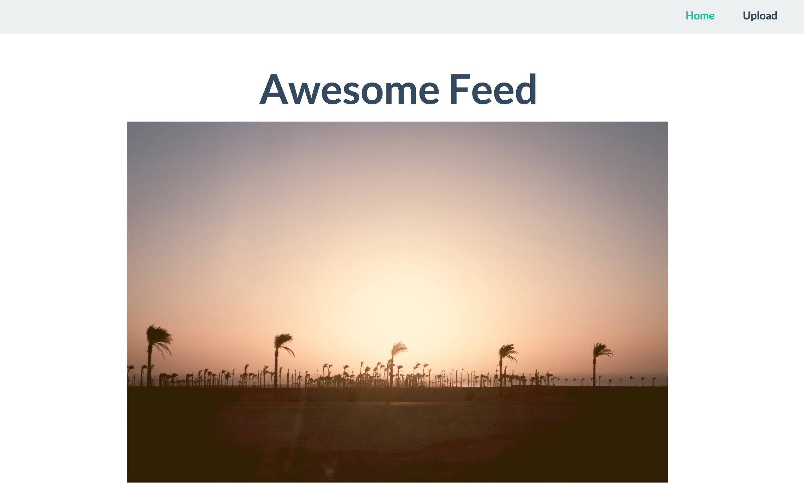
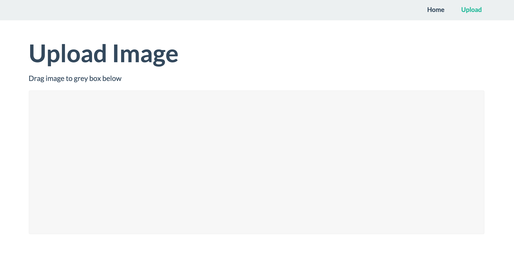

# Awesome Feed
Simple feed that indexes an uploads folder running on Apache server. 

# Features

## Drag and drop image upload
Uses dropzone.js library

## Flat UI
Front-end provided by http://designmodo.github.io/Flat-UI/

### To Do
1. Image query limit
2. Pagination
3. User login
4. Image search
5. Image meta info
6. Session caching
7. Delete image
8. Name image
9. Comments
10. Social share

### Contact Info
Follow me on twitter: [@andreydanil](https:///www.twitter.com/andreydanil) | 
Website: [andreydanil.me](http://andreydanil.me/)